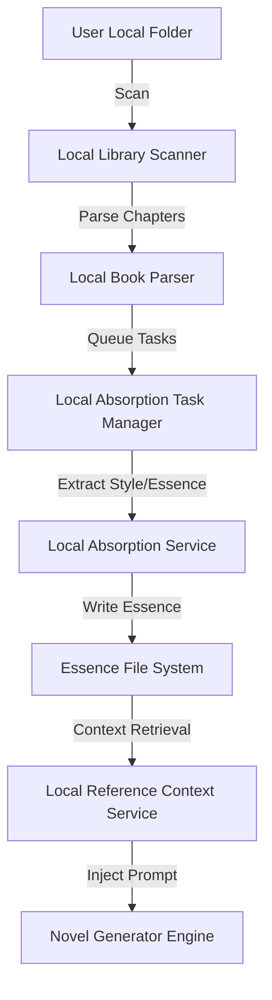

# Local Folder Whole Novel Absorption System (本地文件夹整本小说吸收系统) Skill

This skill provides instructions on how to maintain, test, and expand the "Local Folder Whole Novel Absorption System" in this project.

## System Overview

The system allows users to configure a local folder containing novel source files (`.txt`, `.md`, `.epub`, `.docx`) and another folder for extracted essence. The backend scans, indexes, parses, and asynchronously processes these files to extract style guides, story structures, character profiles, etc., which are then integrated into the AI generation prompt to guide new chapter creation.



## Key Backend Modules

- **Scanner**: `backend/app/services/local_library_scanner.py` - Scans files, tracks modification times and hashes.
- **Guard**: `backend/app/services/local_file_guard.py` - Restricts backend file access to user-configured directories.
- **Parser**: `backend/app/services/local_chapter_boundary_service.py` & `local_book_parser_service.py` - Parses chapters using regex and heuristics.
- **Task Manager**: `backend/app/services/local_absorption_task_manager.py` - Orchestrates asynchronous LLM analysis tasks.
- **Essence System**: `backend/app/services/local_style_mining_service.py` & `local_scene_pattern_service.py` - Generates character, style, and scenario templates.
- **Similarity Guard**: `backend/app/services/local_similarity_guard_service.py` - Detects similarity between generated text and source novels, auto-rewriting if threshold is exceeded.

## Key Frontend Components

- **Library Page**: `frontend/app/local-library/page.tsx` - Management of local files, configs, and tasks.
- **Workbench Integration**: `frontend/components/project/workbench/ProjectBindingPanel.tsx` - Bind reference books to projects.
- **Guard Report**: `frontend/components/project/workbench/SimilarityGuardReport.tsx` - Reports similarity checker results.

## Testing & Verification

Always run tests before committing changes to these modules.

### Backend Tests
Run all local library tests:
```bash
pytest backend/tests -k "local"
```

Or target specific tests:
- Scanner: `pytest backend/tests/test_local_library_scanner.py`
- Parser: `pytest backend/tests/test_local_book_parser.py`
- Guard: `pytest backend/tests/test_local_file_guard.py`
- Task Manager: `pytest backend/tests/test_local_absorption_tasks.py`
- Similarity Guard: `pytest backend/tests/test_similarity_guard.py`

### Frontend Verification
Ensure typescript typechecks pass:
```bash
cd frontend && npm run typecheck
```

## Coding Constraints & Principles

1. **Security (Strict Sandbox)**: Always validate paths using `LocalFileGuard` before any read/write operation. Never allow arbitrary file access.
2. **Privacy**: Never store full book text in the database or logs. The database should only store metadata, file paths, hashes, and task states.
3. **Prompt Safety**: RAG context injection must only include extracted rules, styles, and brief summaries—never huge chunks of raw text from the reference novels.
4. **Environment Switch**: The local library system must respect the `ALLOW_LOCAL_FILE_ACCESS` env flag. If set to `false`, backend file operations should fail gracefully without crashing the server.
